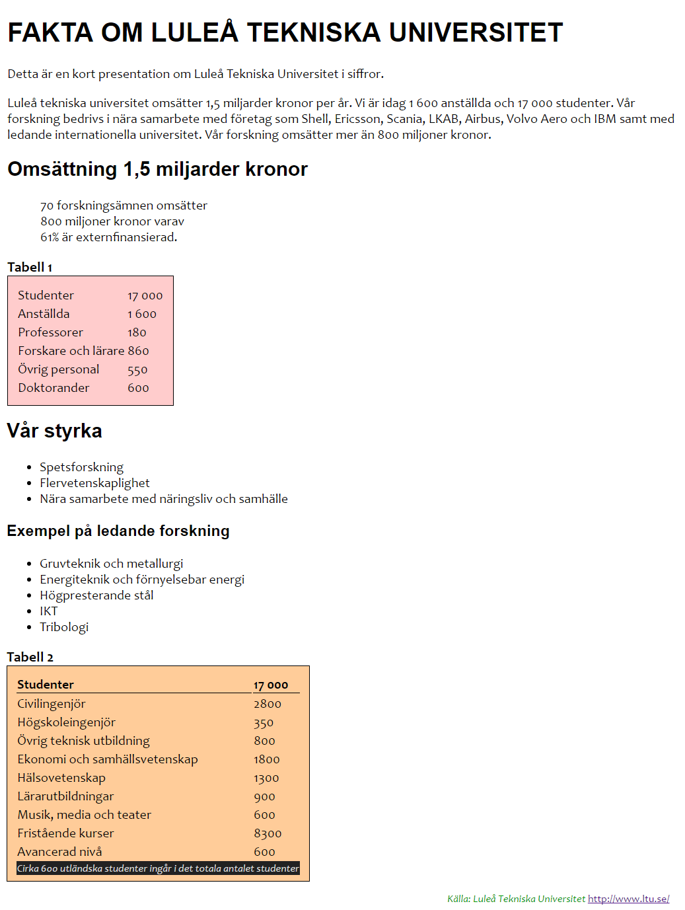
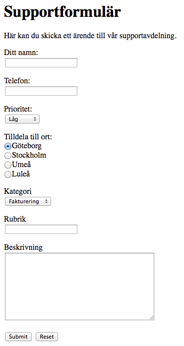
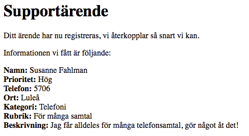
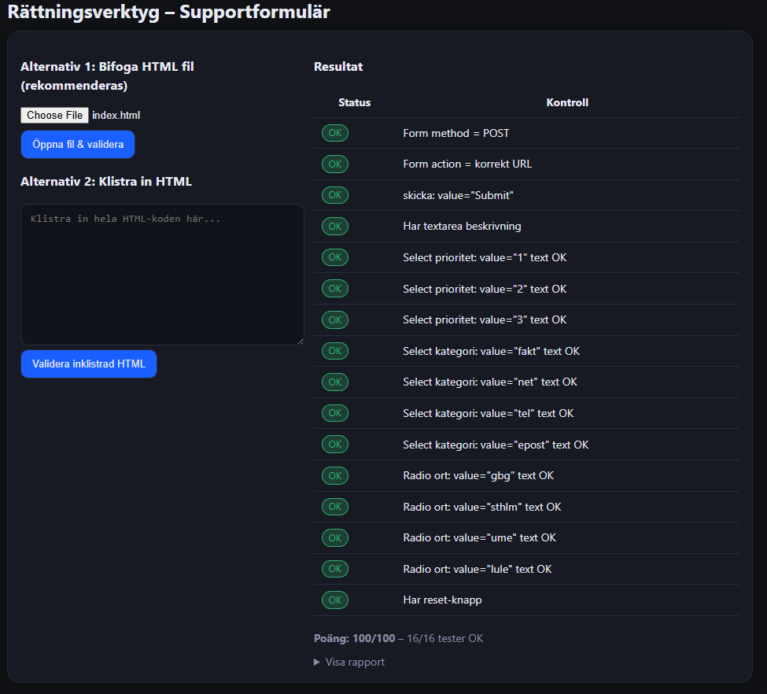

-------------3A-----------------

Innan du börjar med uppgifterna 3a, 3b, 3c och 3d ska du ha läst igenom moment: 3. CSS och formulär
Ladda ner dokumentet ltu.html klicka på ikonen här bredvid för att ladda ner den eller klicka på länken och sen på länken "Download ltu.html" överst på sidan. Du får inte högerklicka och välja "Spara länk som.." Om du laddat ner på rätt sätt men ändå får felmeddelande: "Åtkomst nekad. Du har inte behörighet att visa den här resursen" prova i så fall byta webbläsare, Google Chrome är den webbläsare som jag använder.
Om du öppnar dokumentet i en webbläsare så kommer du finna att det inte är så visuellt tilltalande. Det är då man använder en stilmall skriven i CSS.
I uppgiften ska du använda dig av en extern stilmall, alltså CSS koden ska skrivas i en .css-fil.
Skriv en extern stilmall som innehåller följande regler:

För elementen h1-h6 används typsnitt Arial, Helvetica, sans-serif.
För övrig text används typsnitt Candara, Verdana, sans-serif
Tabell1: bakgrundsfärg #ffcccc
Tabell2: bakgrundsfärg #ffcc99
Gröna färgen till texten längst ner: #009900
Länken ska ändra färg/bakgrundsfärg när man drar muspekaren över den (:hover)

Du ska använda dig både klasser och id i mallen.
När du är klar kan ditt dokument se ungefär ut som bilden nedan.

Kommentera
Att kommentera koden är mycket viktigt! Kommentarer i din css ska ligga mellan /*  och */

/* Det här är en kommentar */
Allt du gör i html-dokumentet ska också kommenteras mellan <!-- och -->
I kommentarerna ska du skriva vad du gjort och varför du gjort det du gjort så att det framgår att du förstått det du gjort.

Publicera
När du ska publicera denna uppgift så måste du först skapa upp en ny mapp i webbkatalogen för dina uppgift 3a-filer, kalla mappen "uppgift3a".  Ladda upp ltu.html samt din css-fil till den mappen på webbservern. I din url, https://swplayground.ltu.se/d0015d/username/ (där username är ditt webbkonto-användarnamn), så måste du nu lägga till namnet på din mapp samt namnet på html-filen (eftersom den inte heter index.html).
Glöm inte att webbservern är skiftlägeskänslig, den gör alltså skillnad på stora och små bokstäver, rekommendationen är att konsekvent använda små bokstäver för mappnamn och filnamn.

Validera
När du har publicerat din hemsida måste du kontrollera så att den fungerar. För även om det ser bra ut på din dator så kanske det inte gör det när man kollar på den via webbservern.
Ser allt bra ut så kopiera länken och gå till https://validator.w3.org/Links to an external site.. Där ska du klistra in din länk och validera via URI. Gör samma med din css genom att gå till https://jigsaw.w3.org/css-validator/Links to an external site.. När både webbsidan och css:en validerar utan fel så kan du lämna in uppgiften.

Inlämning
Inlämning av uppgiften görs genom att klicka på "Lämna in uppgift" här ovan. Länken som lämnas in ska leda till sidan ltu.html. Länken bör se ut något liknande: https://swplayground.ltu.se/d0015d/username/uppgift3a/ltu.html (username är ditt webbkonto-användarnamn).
Om du lämnat in länken och kommer på att du behöver fixa något på sidan går det bra, så länge länken är oförändrad. När vi rättar så hamnar vi ju på den senaste versionen av webbsidan.

Komplettering
Om du missat något i uppgiften så kommer uppgiften att markeras som underkänd. Du ska då åtgärda bristerna i inlämningen och lämna in uppgiften igen. Du laddar upp de rättade html-sidorna på webbservern och för att vi ska veta att du kompletterat uppgiften så måste du som vanligt klicka på "Nytt försök" och lämna in länken på nytt. Eventuella kommentarer som du skriver till en inlämnad uppgift ser vi enbart när vi går in och börjar rätta uppgiften. Det är alltså ingen bra idé att ställa frågor om kompletteringen via kommentarsfältet eftersom vi då inte ser frågan om du inte samtidigt laddar upp en ny inlämning.

---------------3B-----------------

Du ska skapa ett formulär som ser ut på följande sätt:

Webbformuläret ovan används för att skicka ärenden till den påhittade supporten.

Följande ska gälla för formulärets komponenter:

-Ditt namn
  Attributet name ska ha värdet namn.
-Telefon
  Attributet name ska ha värdet telefon.
-Prioritet
  Attributet name ska ha värdet prioritet.
  Ska innehålla följande alternativ:
   *Låg (attributet value ska ha värdet 1)
   *Normal (attributet value ska ha värdet 2)
   *Hög (attributet value ska ha värdet 3)
-Tilldela till ort
  Attributet name ska ha värdet ort.
  Ska innehålla följande alternativ:
   *Göteborg (attributet value ska ha värdet gbg)
   *Stockholm (attributet value ska ha värdet sthlm)
   *Umeå (attributet value ska ha värdet ume)
   *Luleå (attributet value ska ha värdet lule)
-Kategorin
  Attributet name ska ha värdet kategori.
  Ska innehålla följande alternativ:
   *Fakturering (attributet value ska ha värdet fakt)
   *Internet (attributet value ska ha värdet net)
   *Telefoni (attributet value ska ha värdet tel)
   *E-post (attributet value ska ha värdet epost)
-Rubrik
  Attributet name ska ha värdet rubrik.
-Beskrivning
  Attributet name ha värdet beskrivning.
-Submit
  Attributet name ha värdet skicka
  Attributet value ska ha värdet Submit
  Data ska skickas med POST med elementet action i formuläret till: "https://swplayground.ltu.se/resources/parse_form.php".
-Reset
  Ska tömma hela formuläret

**OBS! För att det ska fungera måste webbformuläret köras via en webbserver.

När man trycker på knappen Submit ska du, om du gjort rätt, få tillbaka exempelvis följande svar:

Om man inte får information vid alla rubriker innebär det att man inte har fyllt i alla fält eller att det är något fel i din kod. Det som händer när man klickar på Submit är att formulärets data skickas till en php-sida som tolkar data och presenterar resultatet. Denna php-sida är klar och fungerande så den biten behöver du inte bry dig om.

Du kommer även att se en debug-utskrift, där skrivs data från formuläret ut så att det blir enklare att felsöka om det skulle behövas.

Debug-utskrift av formulärdata:

Array
(
[namn] => Susanne Fahlman
[telefon] => 5706
[prioritet] => 3
[ort] => lule
[kategori] => tel
[rubrik] => För många samtal
[beskrivning] => Jag får alldeles för många telefonsamtal, gör något åt det!
[skicka] => Submit
)

Kommentera
Att kommentera koden är mycket viktigt! Kommentarer i din css (om du har en sådan) ska ligga mellan /*  och */

/* Det här är en kommentar */
Allt du gör i html-dokumentet ska också kommenteras mellan <!-- och -->
I kommentarerna ska du skriva vad du gjort och varför du gjort det du gjort så att det framgår att du förstått det du gjort.

Publicera
När du ska publicera denna uppgift så måste du först skapa upp en ny mapp i webbkatalogen för uppgift 3b, kalla mappen "uppgift3b" och ladda upp html-filen med formuläret i mappen. Använder du en css i denna uppgift så laddar du även upp den. Sist i din url https://swplayground.ltu.se/d0015d/username/ (username är ditt webbkonto-användarnamn) så måste du nu lägga till namnet på din mapp samt namnet på html-filen.
Glöm inte att webbservern är skiftlägeskänslig, den gör alltså skillnad på stora och små bokstäver, rekommendationen är att konsekvent använda små bokstäver för mappnamn och filnamn.

Validera
När du har publicerat din hemsida måste du kontrollera så att den fungerar. För även om det ser bra ut på din dator så kanske det inte gör det när man kollar på den via webbservern.
Det finns även en HTML sidan till ert förfogande: student-validator-1.htmlDownload student-validator-1.html
(om inte länken ovan fungerar så går filen att hämta här med: student-validator-1.html )Links to an external site.
Man laddar ner filen, kör den i webbläsaren och testar sitt formulär via den genom att antingen bifoga den som fil, eller klistra in kod i fältet. Man kan med fördel använda testsidan för att rätta fel i formuläret innan inlämning. Tanken är att alla fält ska bli OK om man har utfört uppgiften på ett korrekt sätt. Vid tveksamheter, hör av er via Canvas till Maxim.
Ser allt bra ut så kopiera länken och gå till https://validator.w3.org/Links to an external site.. Där ska du klistra in din länk och validera via URI. När webbsidan validerar utan fel så kan du lämna in uppgiften.

Inlämning
Inlämning av uppgiften görs genom att klicka på "Lämna in uppgift" här ovan. Länken som lämnas in ska leda till ditt fungerande formulär. Länken bör se ut något liknande: https://swplayground.ltu.se/d0015d/username/uppgift3b/form.html (username är ditt webbkonto-användarnamn), heter din fil något annat än form.html så använder du såklart det filnamnet du har valt.

Om du lämnat in länken och kommer på att du behöver fixa något på sidan går det bra, så länge länken är oförändrad. När vi rättar så hamnar vi ju på den senaste versionen av webbsidan.

VIKTIGT! När ni lämnar in era formulär så ska ni även lämna in en skärmdump från valideringssidan där det framgår att man har OK på alla moment (se exempelbild). Skärmdumpen lämnas in som kommentar till inlämningen.

Klicka på Starta uppgift
Skriv in länken och klicka på Skicka uppgift
Klicka på Inlämningsdetaljer (på höger sida)
Välj Bifoga fil under Lägg till en kommentar
Klicka på Välj fil leta upp din bild och klicka på Öppna
Glöm inte att klicka på Spara
Valideringsskriptet går att hitta under sektionen Validering i uppgiftsbeskrivningen.

Inlämningar utan skärmdumpen kommer ej att rättas.

Komplettering
Om du missat något i uppgiften så kommer uppgiften att markeras som underkänd. Du ska då åtgärda bristerna i inlämningen och lämna in uppgiften igen. Du laddar upp den rättade html-sidan på webbservern och för att vi ska veta att du kompletterat uppgiften så måste du som vanligt klicka på "Nytt försök". Eventuella kommentarer som du skriver till en inlämnad uppgift ser vi enbart när vi går in och börjar rätta uppgiften. Det är alltså ingen bra idé att lämna in länken som en kommentar till den tidigare inlämnade uppgiften eftersom kompletteringen då inte kommer att rättas.

----------EVENTUELLT 3C------------ (Endast för VG)
Denna uppgift är för dig som siktar på ett VG på uppgiften, den behöver alltså inte göras för dig som är nöjd med ett godkänt betyg. Notera att du inte kan lämna in VG-uppgiften i efterhand, så strävar du efter ett VG så ska uppgiften lämnas innan inlämningen stängs.

I denna uppgift ska du förbättra och styla formuläret från uppgift 3b.

Lägg till e-postfält: Inkludera ett fält för e-postadress i formuläret.

Valideringskrav: Specificera att telefonnummer ska ha ett visst format, e-postadressen ska vara giltig, och beskrivningen ska ha ett minimalt antal tecken.

Responsiv design: Anpassa sidan för bredare skärmar och se till att den är responsiv, så att layouten justeras när fönsterstorleken ändras.

CSS: Du ska även använda CSS för att förbättra layouten på formuläret.

Tillgänglighet: Kontrollera och förbättra tillgängligheten på ditt formulär med hjälp av följande adress: http://wave.webaim.org/Links to an external site. eller via Wave-pluginLinks to an external site..

Dokumentation och kommentarer: Kommentera all kod noggrant för att visa att du förstår vad du gör och motivera varför du gör som du gör.

Publicera
Ladda upp html-filen och css-filen i en ny mapp som du skapar på webbservern, mappen bör heta uppgift3d. I din url så måste du nu lägga till namnet på din mapp samt namnet på html-filen. Väl inne på sidan så är det enkelt att kopiera url:en från adressfältet i webbläsaren. Glöm inte att webbservern är skiftlägeskänslig, den gör alltså skillnad på stora och små bokstäver, rekommendationen är att konsekvent använda små bokstäver för mappnamn och filnamn.

Validera
När du har publicerat din hemsida måste du kontrollera så att den fungerar. För även om det ser bra ut på din dator så kanske det inte gör det när man kollar på den via webbservern.

I denna uppgift ingår även att kontrollera och förbättra tillgängligheten via följande adress: http://wave.webaim.org/Links to an external site. eller via Wave-pluginLinks to an external site..

Ser allt bra ut så kopiera länken och gå till https://validator.w3.org/Links to an external site.. Där ska du klistra in din länk och validera via URI. När webbsidan validerar utan fel så kan du lämna in uppgiften.

Inlämning
Inlämning av uppgiften gör genom att klicka på "Starta uppgift" här ovan.

Du lämnar in länken till ditt fungerande formulär.